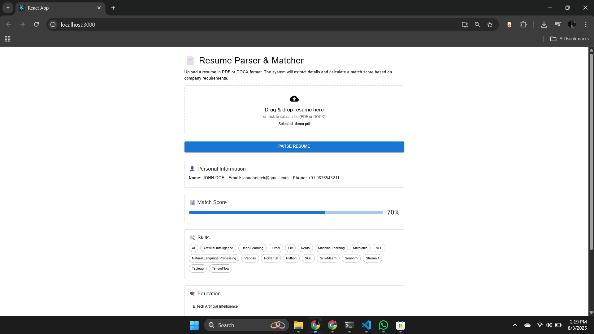

# 🧠 AI Resume Parser Web App

An AI-powered, full-stack web application that parses resumes in PDF/DOCX format, extracts structured information (name, email, phone, skills, education, experience), and evaluates how well a candidate matches company requirements using NLP and a custom scoring algorithm.

---

## 🚀 Features

- 📄 Upload resumes (PDF or DOCX)
- 🤖 Extract:
  - Name, Email, Phone
  - Skills, Education, Experience
- 🧠 NLP-based parsing using spaCy and Regex
- 📊 Match Score against company requirements
- 💾 Save parsed results in PostgreSQL as JSON
- ⚡ Built with FastAPI, React, and asyncpg

---

## 🛠 Tech Stack

**Backend:**
- Python
- FastAPI
- spaCy (NLP)
- Regex
- pdfplumber, docx2txt (file parsing)
- asyncpg + PostgreSQL (DB layer)

**Frontend:**
- React (basic interface)
- Axios (API communication)

**Deployment & Tools:**
- GitHub
- VS Code

---

